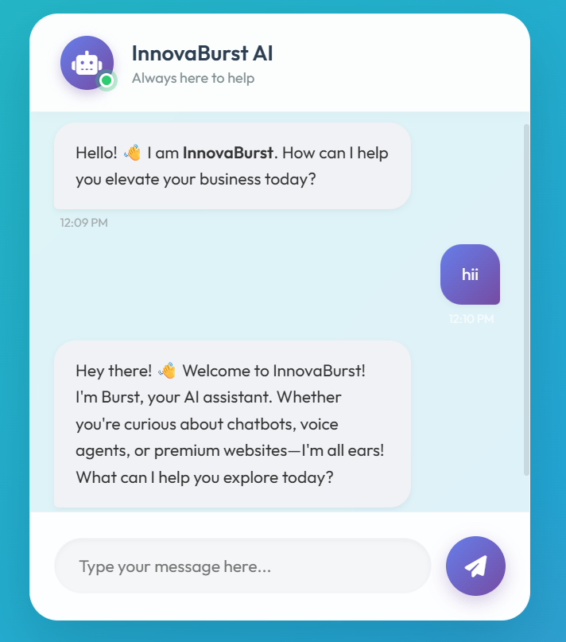
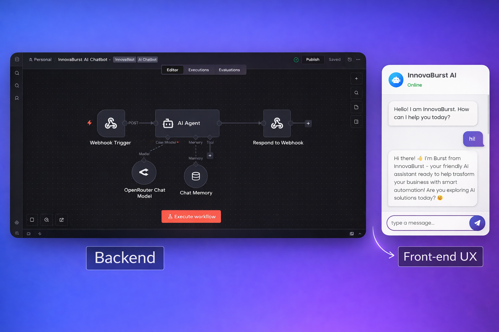

# 🚀 n8n AI Chatbot Automation

A professional AI-powered website chatbot built using n8n automation and a custom frontend UI.
This project showcases how to connect a website chatbot with an AI Agent using webhooks, memory, and real-time responses.

---

## 🔹 Project Overview
This project demonstrates:

- How a website chatbot sends user messages to n8n

- How an AI Agent processes conversations

- How chat memory maintains context

- How responses are sent back to the frontend in real time

The chatbot is suitable for business websites, automation demos, and AI product showcases.

---

## 🧠 Key Features

- Website chatbot connected via Webhook

- AI Agent for intelligent responses

- Chat Memory for context retention

- Real-time message handling

- JSON-based API communication

- Clean, modern chatbot UI

- Fully automated backend using n8n

---

## 🛠 Tech Stack
- n8n (Workflow Automation)
- OpenRouter (AI Chat Model)
- HTML, CSS, JavaScript
- Webhooks & API Integration

---

## ⚙️ Workflow Flow

Frontend UI
   ↓
Webhook Trigger (n8n)
   ↓
AI Agent (OpenRouter Model)
   ↓
Chat Memory (Context)
   ↓
Respond to Webhook
   ↓
Frontend UI

---

## 📂 Project Structure

n8n-ai-chatbot-automation/
│
├── frontend/
│   └── chatbot.html
│
├── workflow/
│   └── n8n-workflow.json
│
├── assets/
│   ├── chatbot-ui.png
│   ├── workflow.png
│   └── result.png
│
├── .gitignore
├── README.md
└── LICENSE

---

## 🚀 How to Use

1. Import the workflow JSON into n8n

2. Activate the workflow

3. Copy the Webhook URL

4. Paste the webhook URL inside chatbot.html

5. Open chatbot.html in your browser

6. Start chatting with the AI chatbot

---

## 🎯 Use Cases
- Business website chatbot
- AI assistant demo
- Lead generation bot
- n8n automation showcase
- Customer support automation
- Portfolio project for developers

---

## 📸 Screenshots

---

## 👤 Author
**Aditya Singh**  
Founder – InnovaBurst

## ⭐ Support
- If you found this project useful:
- Give it a ⭐ on GitHub
- Share it on LinkedIn
- Fork it and build your own automation 🚀

